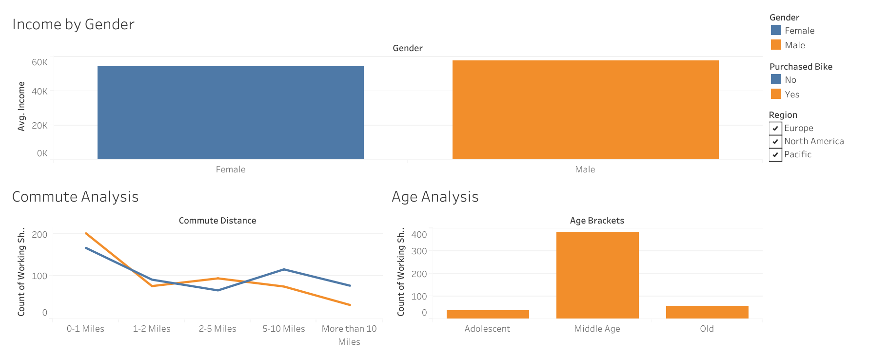

# Bike Sales Strategic Analysis (Excel & Tableau)

## 📌 Project Overview
This project involves a comprehensive analysis of 1,000 customer records to identify key purchasing trends for a bike retail store. The primary objective was to determine which demographic factors—such as age, income, and commute distance—most strongly correlate with a customer's decision to purchase a bike.

To ensure data accuracy and demonstrate cross-platform proficiency, this analysis was performed using a **dual-platform strategy**:
1.  **Microsoft Excel:** For initial data cleaning, exploratory analysis, and pivot table logic.
2.  **Tableau:** For building a scalable, globally accessible dashboard and validating Excel findings.

## 🔗 Interactive Dashboard
👉 **[Click Here to View the Live Tableau Dashboard](https://public.tableau.com/views/BikeSales_17645955638000/Dashboard1?:language=en-US&:sid=&:redirect=auth&:display_count=n&:origin=viz_share_link)**

---

## 📸 Dashboard Previews

### 1. Tableau Dashboard (Web Version)
*Features: Global Filters, Interactive Tooltips, Cloud Hosting.*

### 2. Excel Dashboard (Desktop Version)
*Features: Slicers, Pivot Charts, Complex Logical Formulas.*

---

## 📊 Key Business Insights
* **The "Middle Age" Sweet Spot:** Customers in the **Middle Age** bracket (approx. 35-55) accounted for the majority of sales, significantly outperforming Adolescents and Older demographics.
* **The Commute Factor:** There is a strong negative correlation between commute distance and purchase likelihood. Customers living within **0-1 Miles** of their workplace were **2x more likely** to buy a bike compared to those commuting 10+ miles.
* **Income & Gender:** Male customers with an average income of **$60,000+** showed the highest conversion rate, whereas female purchasing behavior was less sensitive to income fluctuations.

## 🛠️ Tools & Technologies Used
* **Microsoft Excel:**
    * Data Cleaning (Remove Duplicates, Find & Replace).
    * Nested `IF()` statements for Age Brackets.
    * Pivot Tables & Pivot Charts.
    * Interactive Slicers.
* **Tableau Public:**
    * Data Connection & Type Conversion.
    * Calculated Fields.
    * Dashboard Actions (Global Filters).
    * Publication & Web Hosting.

## 📂 File Structure
* `Excel_Project_Bike_Sales_Dashboard.xlsx`: The complete workbook containing Raw Data, Working Sheets, and the Excel Dashboard.
* `dashboard_excel.png`: Static preview of the Excel analysis.
* `dashboard_tableau.png`: Static preview of the Tableau analysis.

---
